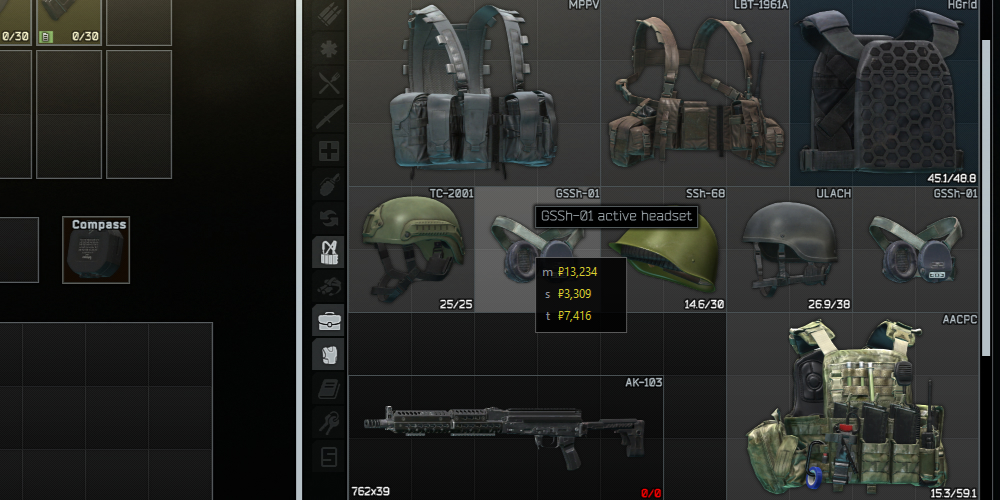
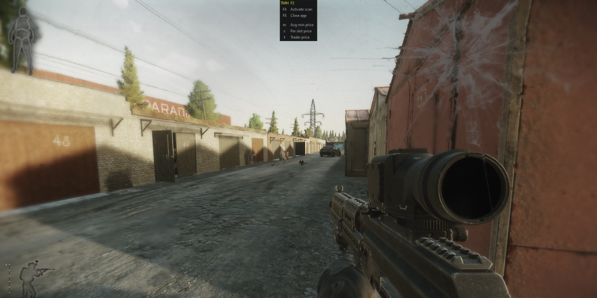
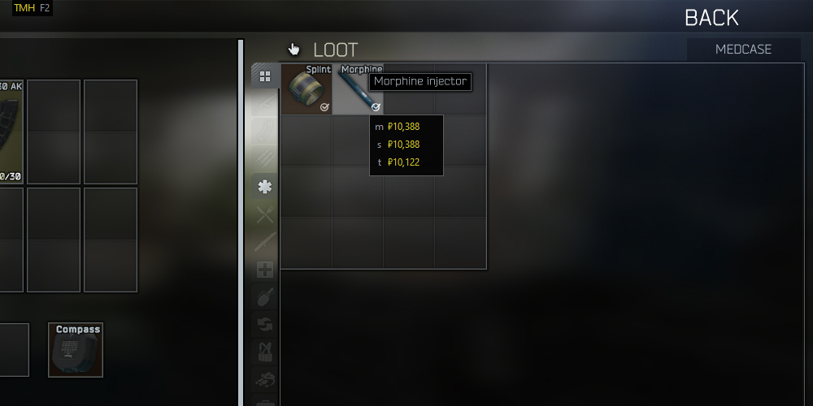

Tarkov Market Helper
=========

TMH is an in-game helper for tracking market prices. The program does not invade the game files in any way and only uses screen images.

`I highly recommend reading the "Known limitations" section`

Features
=========
- [x] In-game interface
- [x] Displays the value of an item on the market
- [x] Displays the value of an item per slot
- [x] Displays the value of an item at the trader
- [x] Hotkey and position customization in settings.ini
- [ ] Displays the importance of an item for a quest or hideout
- [ ] A mark that such an item is already in the stash
- [ ] Item counter

Screenshots
=========

Install
=========
You can download the program archive [here](https://github.com/null-architect/tarkov-market-helper/releases/latest). After unpacking, run `TMH start.bat` inside unpacked folder. The archive with the program also has embedded python with preinstalled libraries, which is heavy.

Usage
=========
After starting the program, an interface will appear at the top in which you can see the name of the program and a hotkey to display help. By clicking on the `Activate scan` hotkey, the program will switch to item scan mode that can be seen in the changing colors of the program name. In scan mode, hover over the item and wait for its name and its value to appear. In the program folder there is a `settings.ini` file in which you can configure program settings and reassign hotkeys.

You can use the program in two ways:
1) Always keep scan mode active (May affect performance)
2) Turn on scan mode if necessary

Data
=========
Item price data is updated once a day and is stored in the cloud. Each time the program is launched, updated pricing data is downloaded.

Known limitations
=========
- Support only borderless mode
- Support only 1920x1080 resolution
- Support only english and russian game clients
- Unstable item scanner
- Scanner requires a long aiming at the object
- Scanner does not work when the item name touches the right edge of the screen
- Can't display the value when trading with a dealer

Unofficial
=========
This program is unofficial and I am not affiliated with the EFT developers in any way. I am not responsible for any consequences of using this code.

Dependencies
=========
Developed on Python 3.7
- `wxPython`
- `keyboard`
- `mouse`
- `pandas`
- `opencv-python`
- `numpy`
- `pillow`
- `requests`